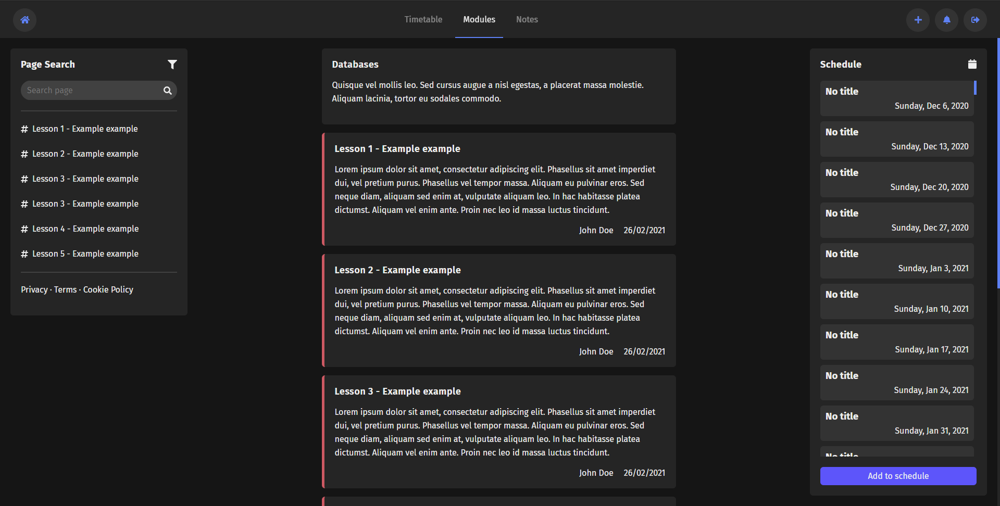
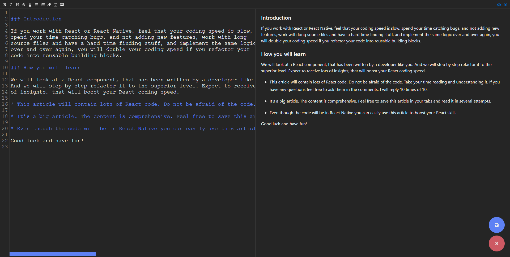
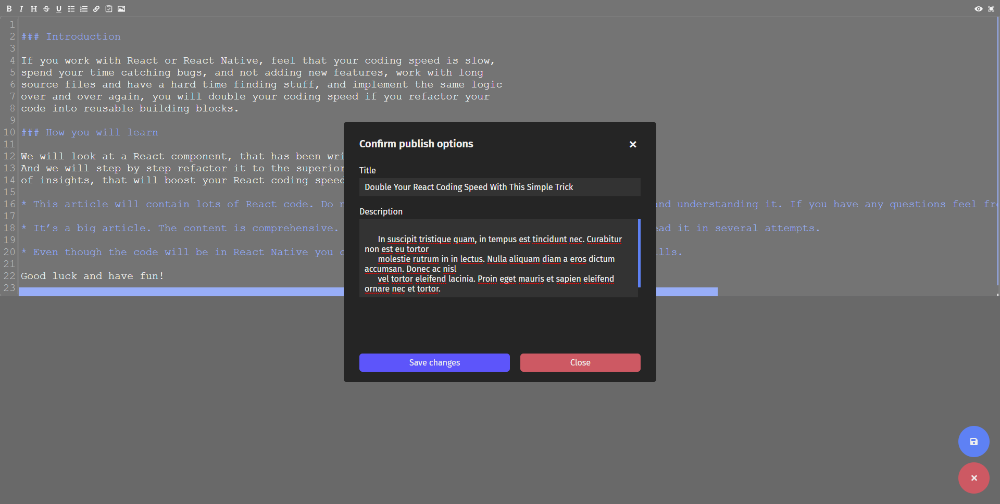
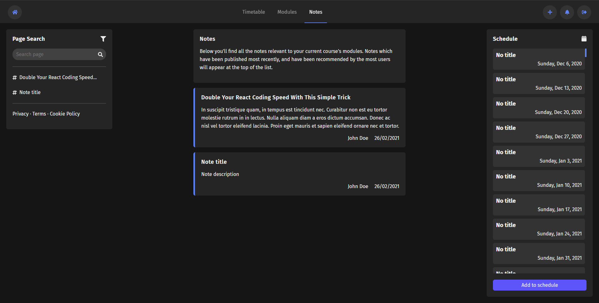
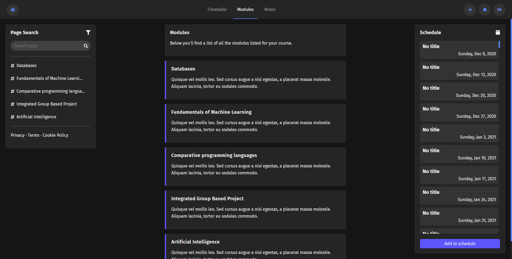
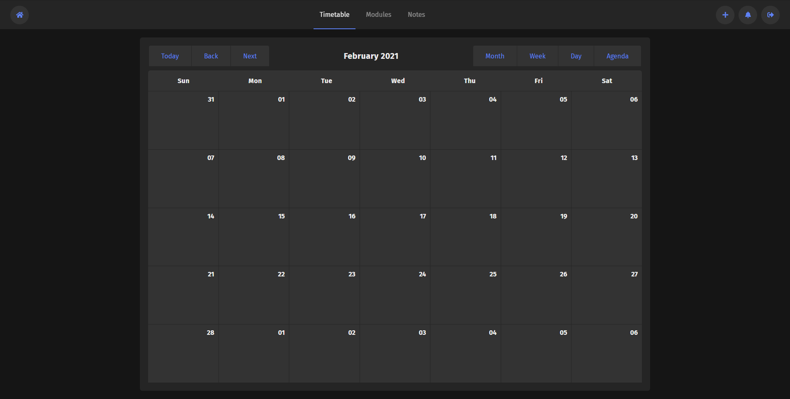

# BetterMoodle

## Installation

### Prerequisites

Ensure you have the following installed before downloading the source code:

* NodeJS
* Java
* GitCLI

If you're using an IDE like Visual Studio Code and you're installing NodeJS for the first time, ensure that node and npm are installed as environment variables, and that you restart the IDE perform continuing. 

### Cloning and Running

1. Open a new terminal and navigate to your current working directory.
2. Enter the following commands:

```bash
git clone https://github.com/BelgianSausage/BetterMoodle.git
cd client
npm install
npm run start
```

3. The following commands will install all necessary dependencies, and open the project in a tab in your default browser at the address [https://localhost:3000](https://localhost:3000)

4. To run the server open a seperate terminal and navigate to the App.java file in the server folder. Run this file.

5. If you want the schedule component to work correctly you will need to edit the GoogleCalendarAPI.ts file and replace the calendar id with your Google calendar public key, and the API key with your Google Calendar API key.

## Gallery






